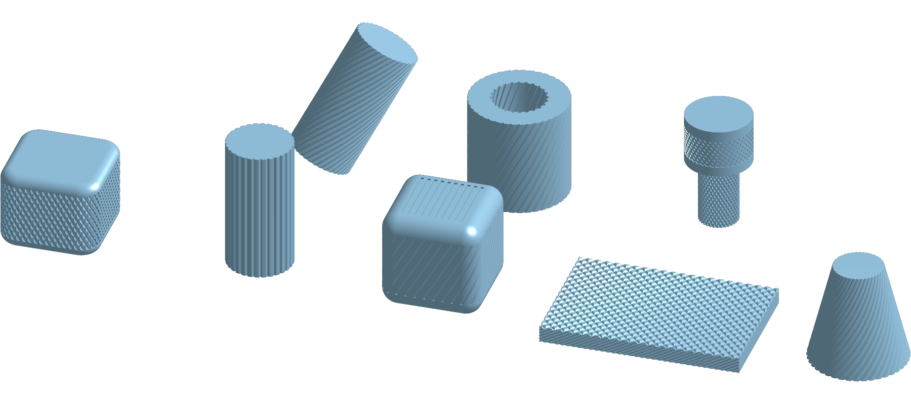

# Knurl for Onshape

**Straight, diagonal and diamond knurling as a native-feeling Onshape feature.** Select a face, pick a
profile and a pitch, and Knurl cuts real grooves into your part: on cylinders, cones, flat faces and
rounded boxes, outside or inside.

Free and open source (MIT). Written in FeatureScript, no add-ins or accounts needed.

| Knurl type | Example |
|---|---|
| Straight | grip ring on a shaft, axial serrations |
| Diagonal (helical) | right- or left-hand knurl on a handle |
| Diamond (crossed) | thumb screws, knobs, tool handles |

## Install

1. Open the public document
   **[Knurl – straight, diagonal & diamond knurling](https://cad.onshape.com/documents/37b9b62067bd3a21705ea22f)**
   (or search the public documents for "Knurl").
2. In your own Part Studio, open **Add custom features** from the custom features button at the right
   end of the toolbar, find the **Knurl** document (search for "Knurl"), and add **Knurl** from its
   latest version.
3. **Knurl** now appears in your toolbar. Updates arrive when you switch the toolbar entry to a newer
   version.

Alternative: create a Feature Studio in your own document, paste [`knurl.fs`](knurl.fs) into it, and add
the feature to your toolbar from that document.

## Quick start

1. Click **Knurl** and select the outside face of a cylinder.
2. Choose **Directions: Double (diamond)**, **Angle 30 deg**, **Spacing: Pitch 1 mm**, **Profile: V**,
   **Depth 0.4 mm**.
3. Click the green check. The info message shows the groove count, the actual pitch and the face count.

## What it can knurl

| Selection | How the grooves follow it |
|---|---|
| Cylinder (outside or bore) | exact helices around the axis; any orientation |
| Cone (outside or countersink) | grooves follow the taper; size and pitch are set at the mid radius and scale along the cone |
| Planar face | straight grooves at an angle to a reference direction, stopping at the face boundary (holes included) |
| Band: several connected faces around a part, e.g. the 4 sides and 4 vertical fillets of a rounded box | laid out on the unrolled band, so pitch and angle stay exact across the fillets |

Select several faces that are not connected and each is knurled on its own. Faces that touch each other
are knurled together as one band.

## Parameters

**Pattern**

| Parameter | Default | Meaning |
|---|---|---|
| Faces to knurl | | Cylinders, cones and planar faces. Connected faces form one band. |
| Directions | Single | Single: one set of parallel grooves. Double (diamond): two crossing sets. |
| Angle (0 = straight) | 30 deg | Angle between the grooves and the axis (cylinders, cones), the band direction (bands) or the reference direction (planar faces). 0 to 75 deg. |
| Hand | Right hand | Single only. Right hand turns like a right-hand thread. No effect at angle 0. |
| Independent second angle | off | Double only. Off: the second set mirrors the first. |
| Second angle | 30 deg | Double only. Angle of the left-hand set. |
| Spacing | Groove count | Groove count or pitch. |
| Groove count | 40 | Grooves per set: around a cylinder, cone or band; across a planar face. |
| Pitch (normal to grooves) | 1 mm | Distance between neighbouring grooves, perpendicular to them. Rounded to a whole number of grooves around closed faces; on cones it applies at the mid radius. |
| Reference direction (planar faces) | longest straight edge | Edge, axis or plane that the angle on planar faces is measured from. |

**Cutter**

| Parameter | Default | Meaning |
|---|---|---|
| Profile | V (triangle) | V, Round or Square groove cross-section. |
| Depth | 0.4 mm | Groove depth, perpendicular to the surface. |
| Included tip angle | 90 deg | V only. Angle between the two flanks. |
| Cutter radius | 0.5 mm | Round only. Depth must be less than the cutter diameter. |
| Groove width | 0.5 mm | Square only. |

**Limits** (collapsed)

| Parameter | Default | Meaning |
|---|---|---|
| Margin from face ends | 0 mm | Keeps grooves this far from the ends of cylinders, cones and bands. At 0, grooves run out cleanly past open flat ends and stop at shoulders, chamfers and fillets. |
| Maximum groove count | 500 | Safety limit for the total number of grooves. |

All dialog values accept expressions and variables as usual.

## Tips and limits

- **Diamond knurls are heavy.** Every crossing creates faces; a 30 mm knurl at 1 mm pitch can produce
  thousands. The feature warns above 20,000 faces. Use a coarser pitch while modelling, or suppress
  the knurl while you work on other features.
- **Pitch, angle and diameter interact.** Around closed faces the groove count is rounded to a whole
  number, so the actual pitch is slightly different from the one you enter. The info message shows it.
- **Cones:** the helix angle is exact at the mid radius and changes slowly toward the ends.
- **Bands** must be a closed loop of flat faces and fillets that all run in the same direction.
  Top fillets and corner blends cannot be part of a band; knurl them separately or leave them out.
- **Not supported:** partial cylinders or cones (faces that do not go all the way around), open strips
  of faces, and freeform surfaces. The feature highlights the faces it cannot handle and says why.

## Troubleshooting

| Message | What to do |
|---|---|
| This knurl needs N grooves, more than the maximum | Increase the pitch or lower the count, or raise **Maximum groove count**. |
| Knurl depth must be less than half the radius | Use a smaller depth on small diameters. |
| Partial cylindrical or conical faces are not supported | Select a face that goes all the way around. |
| The selected faces do not form a closed band | Select every face around the part, or knurl faces separately. |
| The highlighted concave fillet is too tight for this groove size | Use a smaller depth or groove, or a larger fillet. |
| Cutting the knurl failed (code) | Try a slightly different depth, pitch or angle. Please report it with the code. |

## Versions and support

Version history: [CHANGELOG.md](CHANGELOG.md). Knurl is built on FeatureScript std 3083.0.
Bug reports and ideas are welcome in [GitHub Issues](https://github.com/simon-lumikello/onshape-knurl/issues);
include the error message and, if possible, a link to a public document that shows the problem.
Pull requests are welcome too; see [docs/DEVELOPMENT.md](docs/DEVELOPMENT.md).

## Development

How the feature works: [docs/ARCHITECTURE.md](docs/ARCHITECTURE.md).
Setting up the API-driven dev loop and regression tests: [docs/DEVELOPMENT.md](docs/DEVELOPMENT.md).

## License

[MIT](LICENSE) © 2026 Simon Lumikello
